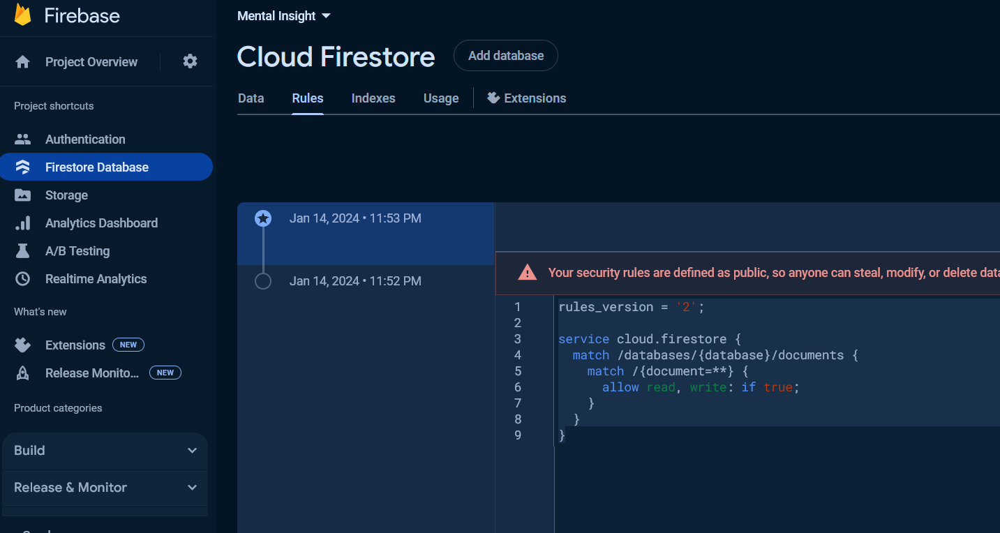
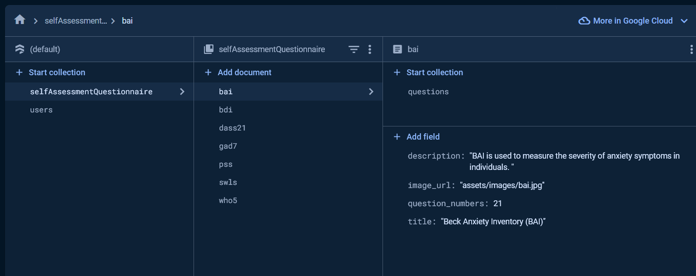

# Mental Insight App

This app provides a mental health insight to an users by providing them a platform to do self-assessment quiz and providing them feedback once they complete the quiz. The users are also provided with extra resources to help them with their mental with their mental health.

## Getting Started using APK (easier way to use app)

To use an app, user needs to download the APK file in their andriod devices, with a good internet connection.

User can download the APK file of an app using the below link:

- [Click here to download the apk file](https://drive.google.com/file/d/1NCatlfCciqOsu_hvBEqeb3av_gRTa_Yc/view?usp=sharing)

User might need to allow installations from unknown sources temporarily.

This can usually be done in the device’s settings under

```
$ Security or Apps & notifications > 'Special app access > Install unknown apps.
```

Once the user download the app, then user can sign-up to create an account and access the app. The tutorial for the app is displayed to the users, once they log in to the app.

## Building an app using Source code

In order to run this app, the user need to install and set-up the Firebase and Flutter.

- [Install the latest version of the Flutter SDK for your development platform](https://docs.flutter.dev/get-started/install)
- Make sure the visual studio code is available with Flutter and Dart plugins installed so you can open the source code, edit and run the project.
- [Install the Firebase CLI for your development platform](https://firebase.google.com/docs/cli)
- Open the project in your IDE (preferably in Visual Studio Code) and [Add Firebase to the flutter app](https://firebase.google.com/docs/flutter/setup?platform=android) using the step provided. User need to make sure they are following the step for the andriod device.
- Ensure that the Firebase project is set up with the user's Android application's package name.

Once the Firebase is and flutter is set-up. The user need to make following changes to run the app successfully.

- The user need to login to their Firebase account and go to their project they have created to store backend data for this project.
- Then User needs to go to the Firestore Database > Rules as shown below and update the following texts.
- 
```
rules_version = '2';

service cloud.firestore {
  match /databases/{database}/documents {
    match /{document=**} {
      allow read, write: if true;
    }
  }
}
```
Then the user need to upload the Self-Assessment Quiz to the backend:

- Open a terminal in the IDE and run the below comment to install all the packages available from pubspec.yaml
```
flutter pub get
```
- Ensure an [Andriod Emulator](https://developer.android.com/studio/run/emulator) is set-up and running or connect your andriod device vis USB and enable USB debugging.

- Then comment out the latest code from main class and replace with the below code:
```
import 'package:firebase_core/firebase_core.dart';
import 'package:flutter/material.dart';
import 'package:get/get.dart';
import 'package:wellbeing_junction/app_routes.dart';
import 'package:wellbeing_junction/bindings.dart';
import 'package:wellbeing_junction/controllers/questionnaire/quiz_data_uploader_screen.dart';
import 'package:wellbeing_junction/firebase_options.dart';
Future<void> main() async {
  WidgetsFlutterBinding.ensureInitialized(); //Initalise the firebase
  await Firebase.initializeApp(
    options: DefaultFirebaseOptions
        .currentPlatform, //https://firebase.google.com/docs/flutter/setup?platform=ios
  );
  //runApp(const MyApp());
  runApp(GetMaterialApp(home: QuizDataUploadScreen()));
}
```
Also comment out the latest code from models folder > normal_question_model.dart file

```
import 'package:cloud_firestore/cloud_firestore.dart';
import 'dart:convert';
// refrence: https://jsontodart.com/

class GeneralQuestionModel {
  String id;
  String title;
  String? imageUrl;
  String description;
  List<Questions>? questions;

  GeneralQuestionModel(
      {required this.id,
      required this.title,
      required this.imageUrl,
      required this.description,
      required this.questions});

  GeneralQuestionModel.fromJson(Map<String, dynamic> json)
      : id = json['id'] as String,
        title = json['title'] as String,
        imageUrl = json['image_url'] as String,
        description = json['Description'] as String,
        questions = (json['questions'] as List)
            .map((dynamic e) => Questions.fromJson(e as Map<String, dynamic>))
            .toList();

  Map<String, dynamic> toJson() {
    final Map<String, dynamic> data = <String, dynamic>{};
    data['id'] = id;
    data['title'] = title;
    data['image_url'] = imageUrl;
    data['Description'] = description;
    return data;
  }
}

class Questions {
  String id;
  String question;
  String? category;
  List<Options> options;

  Questions(
      {required this.id,
      required this.question,
      required this.category,
      required this.options});

  Questions.fromJson(Map<String, dynamic> json)
      : //with : the valu gets initialised before the constructor body runs
        id = json['id'],
        question = json['question'],
        category = json['category'],
        options = (json['options'] as List)
            .map((e) => Options.fromJson(e as Map<String, dynamic>))
            .toList();

  Map<String, dynamic> toJson() {
    final Map<String, dynamic> data = <String, dynamic>{};
    data['id'] = id;
    data['question'] = question;
    data['category'] = category;
    data['options'] = options.map((v) => v.toJson()).toList();
    return data;
  }
}

class Options {
  String? text;
  int? points;

  Options({this.text, this.points});

  Options.fromJson(Map<String, dynamic> json)
      : text = json['text'] as String?,
        points = int.tryParse(json['points'].toString());

  Options.fromSnapshot(QueryDocumentSnapshot<Map<String, dynamic>> snapshot)
      : text = snapshot['text'] as String?,
        points = snapshot['points'] as int?;

  Map<String, dynamic> toJson() => {'text': text, 'points': points};
}

```
- Then run the below code
```
flutter run

```
Once the users see "Upload is complete now" then change the code back to normal. The users should also see the self-assesment quiz uploaded at the backend. It should look something like below image. 
- 

Once the code are back to how it previously was, the user can run the below command in the terminal to run the app normally in their emualtor.
```
flutter clean

```
```
flutter run

```

## Reference
- [Used to add images in the app] Suragch (2019) How to include images in your flutter app, Medium. Available at: https://suragch.medium.com/how-to-include-images-in-your-flutter-app-863889fc0b29 (Accessed: 05 April 2024). 
- [Used to get help with firbase] Koko, M. (2023) 📱 the wall / coding a social media app • flutter X firebase tutorial, YouTube. Available at: https://www.youtube.com/watch?v=yJ7qQxzkh9E&t=223s&ab_channel=MitchKoko (Accessed: 05 April 2024). 
- [Used for firebase Auth help] Ortan 8511 silver badge99 bronze badges, R. and Andres 19211 silver badge88 bronze badges, E. (1966) Flutter firebase how to sign in users with google, Stack Overflow. Available at: https://stackoverflow.com/questions/62865532/flutter-firebase-how-to-sign-in-users-with-google (Accessed: 05 April 2024). 
- [Used for firebase Auth help] firebase (2023) Federated Identity & Social Sign-in  |  firebase documentation, Google. Available at: https://firebase.google.com/docs/auth/flutter/federated-auth (Accessed: 05 April 2024). 
- [Used for drawer style of UI] Flutter (no date) Add a drawer to a screen, Flutter. Available at: https://docs.flutter.dev/cookbook/design/drawer (Accessed: 05 April 2024). 
- [button UI] FlutterOfficialWebsite (no date) New buttons and Button themes, Flutter. Available at: https://docs.flutter.dev/release/breaking-changes/buttons (Accessed: 05 April 2024). 
- [regarding who-5 and other analysis] Omani-Samani, R. et al. (2019) The WHO-5 well-being index: A validation study in people with infertility, Iranian journal of public health. Available at: https://www.ncbi.nlm.nih.gov/pmc/articles/PMC6961185/ (Accessed: 05 April 2024). 
- [Refrence for mapping used in result_controller] Programming Point (2022) Collections in Dart: List, map and set | flutter dart tutorial #17, YouTube. Available at: https://www.youtube.com/watch?v=pxsKvudZpOQ&ab_channel=ProgrammingPoint (Accessed: 05 April 2024). 
- [For retrieving data] Koko (2022) (CRUD)📱read & display data • firebase X flutter tutorial ♡, YouTube. Available at: https://www.youtube.com/watch?v=PBxbWZZTG2Q&t=1224s&ab_channel=MitchKoko (Accessed: 05 April 2024). 
- [Used for uploading and loading data from firebase] dbestech (2022) Flutter educational app | exam | study | app with Backend Tutorial Complete Firebase App. Available at: https://www.youtube.com/watch?v=KQcjvDBLcSs&ab_channel=dbestech (Accessed: 02 April 2024).
